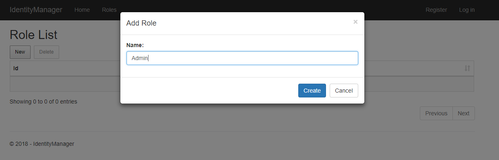
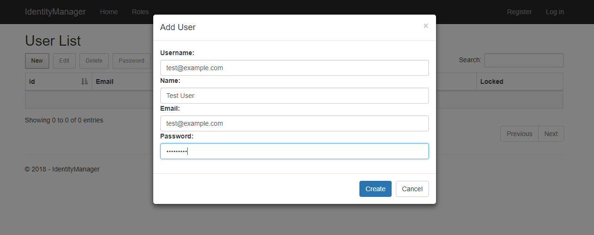
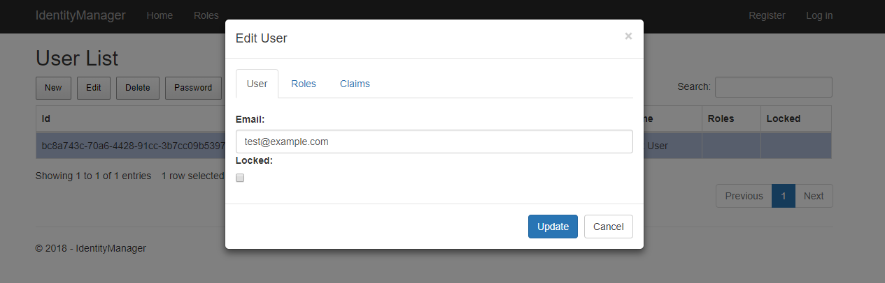
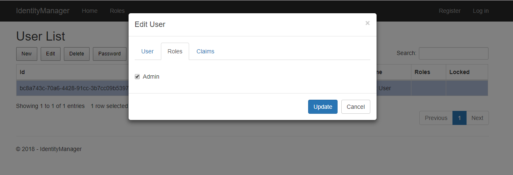
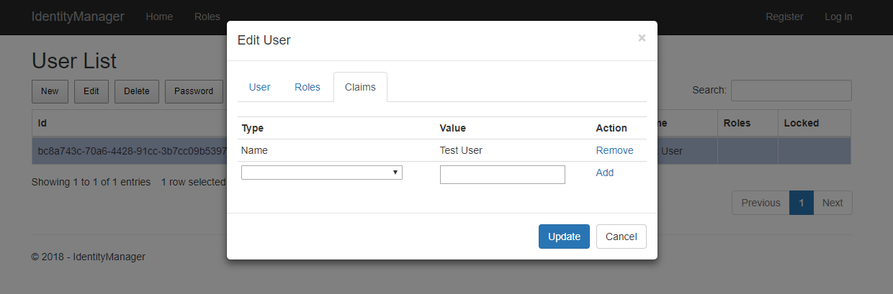

# Identity Manager
Identity management system for [ASP.NET Core Identity](https://github.com/aspnet/Identity).

**This GitHub project is deprecated.** Ongoing development can be found at <https://github.com/mguinness/IdentityManagerUI>.

## Introduction
When creating a new ASP.NET Core project you have the option to change the authentication to individual user accounts which includes templates to wire up the identity system into your website. This includes registration, login and several pages related to user account self management like 2FA and password reset.

The missing piece to the puzzle is user management for the site.  For ASP.NET membership there was [ASP.NET Website Administration Tool (WSAT)](https://docs.microsoft.com/en-us/aspnet/web-forms/overview/older-versions-getting-started/deploying-web-site-projects/users-and-roles-on-the-production-website-cs) and for ASP.NET Identity there was [Identity Manager](http://brockallen.com/2014/04/09/introducing-thinktecture-identitymanager/) by Brock Allen.  AFAIK there is no solution available for ASP.NET Core Identity so this repo is an effort to remedy that.

## Setup
The first step when running the project is to apply the migration to a new SQLite database file.  This creates all the necessary tables for ASP.NET Identity Core to function.  Once complete you will be able to use the website to manage users, roles and claims.  Please note that the authentication is not required to use the website as it stands.  This can be easily rectified by adding `[Authorize(Roles = "Admin")]` attribute to the HomeController class after you have created your initial users.

## Features
The first thing that you will likely do is create a new administrator role to manage additional users.

Once done you can create a new user by providing basic information like username and password.

After the user has been created you can then edit email address and lock account if required. 

In the user edit dialog you can select the Roles tab to assign user to previously defined roles.

In addition you can also select the Claims tab to add or remove claims to the user being edited.

